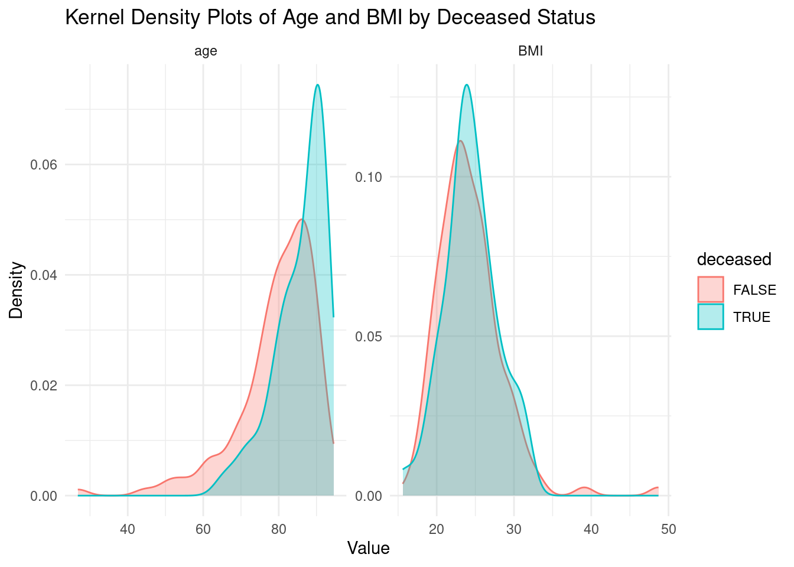
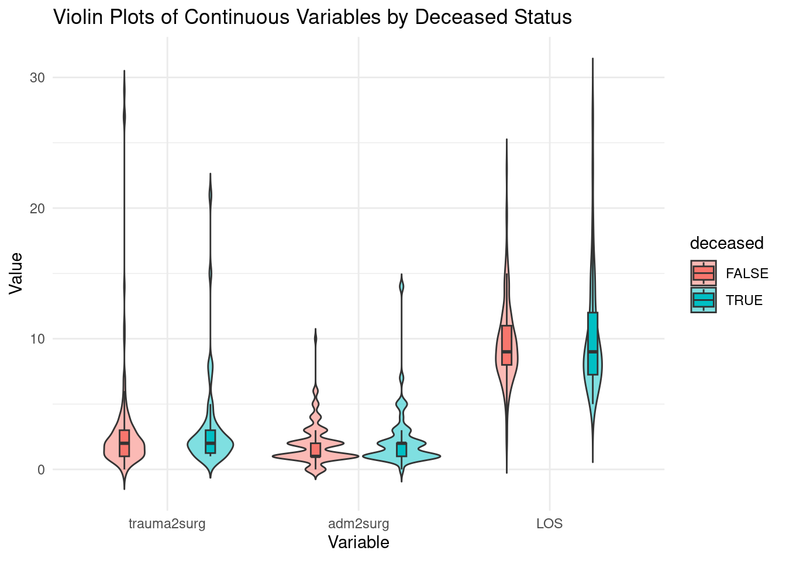
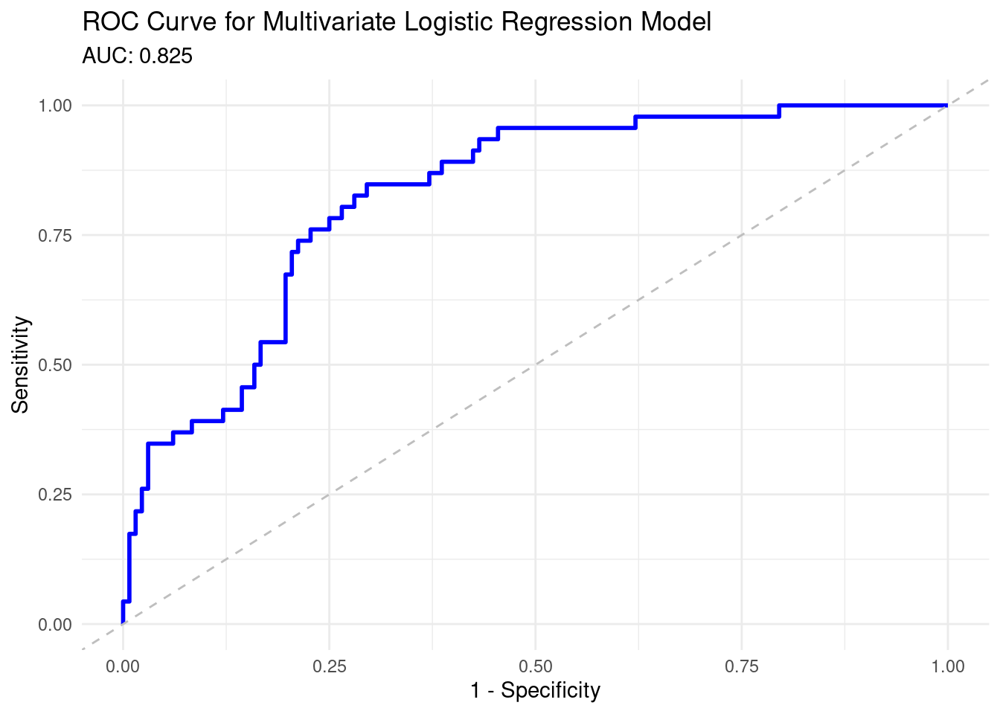
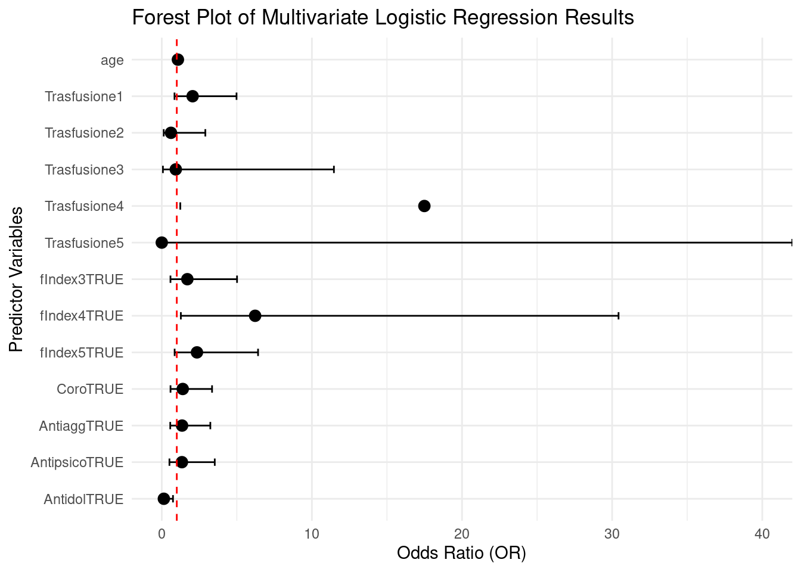
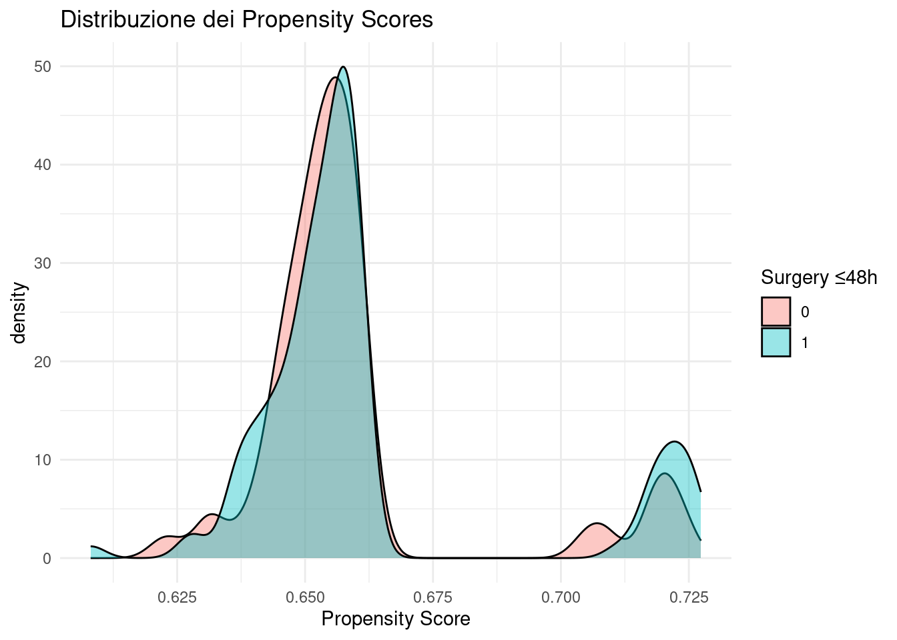
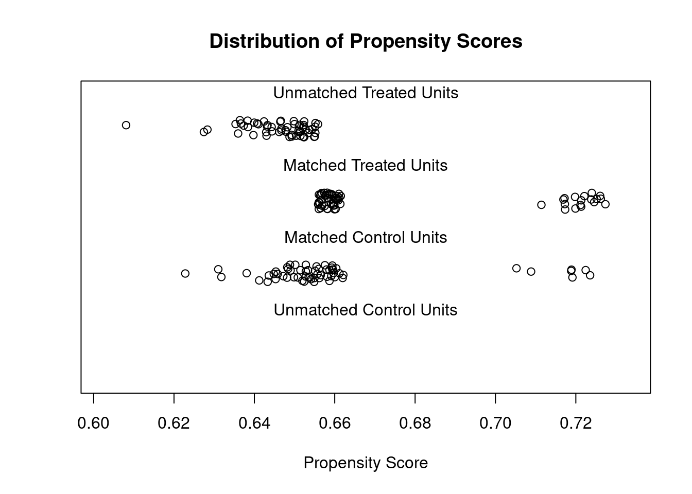
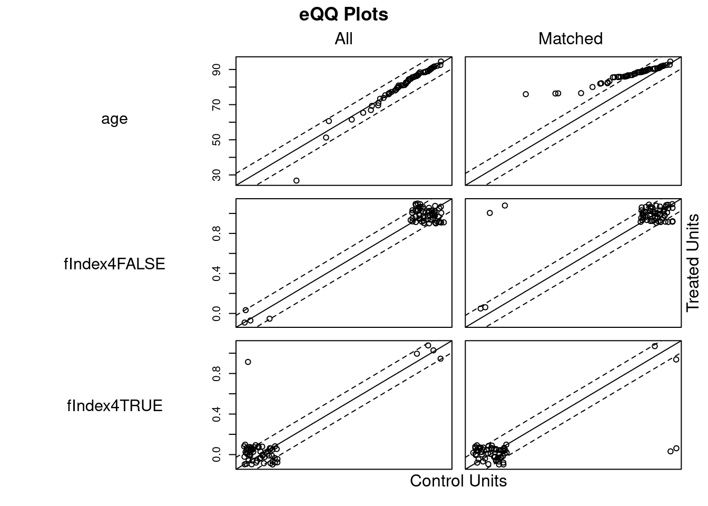
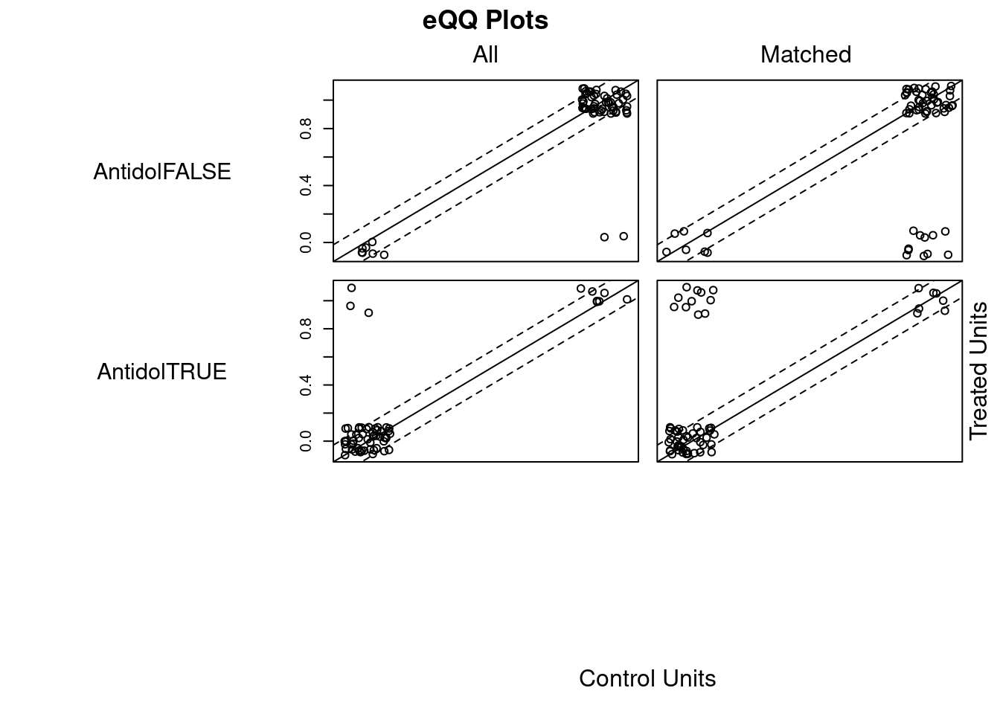
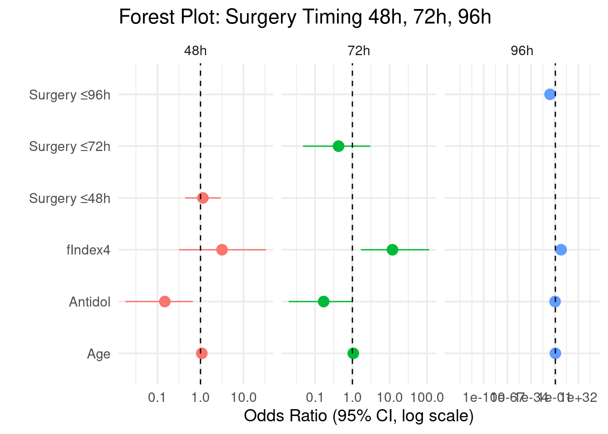

::: {.container-fluid .main-container}
::: {#header}
analysisTRY.Rmd {#analysistry.rmd .title .toc-ignore}
===============

#### Orlando Sagliocco {#orlando-sagliocco .author}

#### 2025-09-26 {#section .date}
:::

::: {#analysis-of-hip-fracture-data-2024-dott.-ferri .section .level1}
Analysis of Hip Fracture Data (2024) (Dott. Ferri)
==================================================

::: {#installation-and-loading-of-required-packages .section .level2}
Installation and loading of required packages
---------------------------------------------

``` {.r}
# List of required packages
required_packages <- c(
    "broom", "kableExtra", "pROC", "tidyverse", "parameters",
    "insight", "httpgd", "tableone", "ggplot2", "reshape2", "performance", "caret", "detectseparation",
    "MatchIt", "cobalt"
)

# Install missing packages
installed <- required_packages %in% rownames(installed.packages())
if (any(!installed)) {
    install.packages(required_packages[!installed])
}

# Load necessary libraries
lapply(required_packages, library, character.only = TRUE)
```

I successivi step verranno enumerati seguedo lo [Statistical Analysis
Plan](../protocols//StatisticalAnalysisPlan.md).
:::

::: {#data-cleaning-and-descriptive-statistics-frequencies-missing. .section .level2}
1. Data cleaning and descriptive statistics (frequencies, missing).
-------------------------------------------------------------------

Load the dataset & sow first lines. We are now using manipulated
dataset. Optimal data cleaning routine will be created later on.

``` {.r}
data <- readRDS("../data/HIPfracture-nonames-mock-dataset.rds")
head(data)
```

    ## # A tibble: 6 × 44
    ##      ID deceased female   age    wt  hght   BMI trauma_to_surgery
    ##   <dbl> <lgl>    <lgl>  <dbl> <dbl> <dbl> <dbl>             <dbl>
    ## 1     1 FALSE    TRUE    81.2    53   160  20.7                 3
    ## 2     2 FALSE    TRUE    78.6    80   160  31.2                 1
    ## 3     3 FALSE    TRUE    80.0    45   160  17.6                 1
    ## 4     4 FALSE    FALSE   85.7    65   170  22.5                 1
    ## 5     6 FALSE    TRUE    71      63   164  23.4                 0
    ## 6     8 TRUE     TRUE    88.5    52   160  20.3                 1
    ## # ℹ 36 more variables: admission_to_surgery <dbl>, LOS <dbl>, oldBMI <dbl>,
    ## #   traumaD <date>, admissionD <date>, operationD <date>, dischargeD <date>,
    ## #   from <fct>, to <fct>, fIndex1 <lgl>, fIndex2 <lgl>, fIndex3 <lgl>,
    ## #   fIndex4 <lgl>, fIndex5 <lgl>, Coro <lgl>, Disl <lgl>, CognImp <lgl>,
    ## #   Oncol <lgl>, Anticoag <lgl>, Antiagg <lgl>, Antipsico <lgl>,
    ## #   Antidepress <lgl>, BDZ <lgl>, Antidol <lgl>, ASA <fct>, Risk <fct>,
    ## #   Anestesia <fct>, Inotropi <chr>, Trasfusione <fct>, Intervento <fct>, …

L'unica variabile categorica che non è stata convertita in fattore è
"deceased", che rappresenta lo stato di decesso al follow-up.
Convertiamola in fattore per una corretta analisi.

``` {.r}
data$deceased <- as.factor(data$deceased)
str(data$deceased)
```

    ##  Factor w/ 2 levels "FALSE","TRUE": 1 1 1 1 1 2 1 1 1 1 ...

Esploriamo la struttura del dataset e otteniamo un sommario delle
variabili. Rinominiamo alcune variabili per migliore impaginazione
(trauma\_to\_surgery e admission\_to\_surgery).

``` {.r}
data <- data %>%
  rename(
    trauma2surg  = trauma_to_surgery,
    adm2surg = admission_to_surgery
  )
```

Eseguiamo un glimpse del dataset.

``` {.r}
glimpse(data)   
```

    ## Rows: 180
    ## Columns: 44
    ## $ ID              <dbl> 1, 2, 3, 4, 6, 8, 9, 10, 11, 12, 13, 14, 15, 16, 17, 1…
    ## $ deceased        <fct> FALSE, FALSE, FALSE, FALSE, FALSE, TRUE, FALSE, FALSE,…
    ## $ female          <lgl> TRUE, TRUE, TRUE, FALSE, TRUE, TRUE, TRUE, FALSE, TRUE…
    ## $ age             <dbl> 81.16438, 78.63014, 79.95890, 85.74521, 71.00000, 88.4…
    ## $ wt              <dbl> 53, 80, 45, 65, 63, 52, 60, 65, 55, 45, 52, 48, 60, 58…
    ## $ hght            <dbl> 160, 160, 160, 170, 164, 160, 162, 170, 155, 150, 160,…
    ## $ BMI             <dbl> 20.7, 31.2, 17.6, 22.5, 23.4, 20.3, 22.9, 22.5, 22.9, …
    ## $ trauma2surg     <dbl> 3, 1, 1, 1, 0, 1, 1, 4, 3, 1, 2, 2, 29, 1, 1, 27, 1, 3…
    ## $ adm2surg        <dbl> 3, 1, 0, 1, 0, 1, 1, 4, 3, 1, 2, 2, 1, 1, 1, 1, 1, 3, …
    ## $ LOS             <dbl> 10, 10, 10, 6, 12, 5, 8, 11, 8, 8, 11, 10, 10, 5, 10, …
    ## $ oldBMI          <dbl> 20.70312, 31.25000, 17.57812, 22.49135, 23.42356, 20.3…
    ## $ traumaD         <date> 2021-05-31, 2021-05-09, 2021-05-06, 2021-06-12, 2021-…
    ## $ admissionD      <date> 2021-05-31, 2021-05-09, 2021-05-07, 2021-06-12, 2021-…
    ## $ operationD      <date> 2021-06-03, 2021-05-10, 2021-05-07, 2021-06-13, 2021-…
    ## $ dischargeD      <date> 2021-06-10, 2021-05-19, 2021-05-17, 2021-06-18, 2021-…
    ## $ from            <fct> 1, 1, 1, 1, 1, 3, 2, 1, 2, 1, 1, 1, 1, 2, 1, 2, 1, 1, …
    ## $ to              <fct> 2, 2, 3, 2, 4, 3, 3, 2, 3, 3, 3, 4, 4, 2, 2, 4, 4, 2, …
    ## $ fIndex1         <lgl> FALSE, FALSE, FALSE, FALSE, FALSE, FALSE, FALSE, TRUE,…
    ## $ fIndex2         <lgl> FALSE, FALSE, FALSE, FALSE, FALSE, FALSE, FALSE, FALSE…
    ## $ fIndex3         <lgl> FALSE, TRUE, TRUE, TRUE, FALSE, TRUE, TRUE, TRUE, TRUE…
    ## $ fIndex4         <lgl> FALSE, FALSE, FALSE, FALSE, FALSE, FALSE, FALSE, FALSE…
    ## $ fIndex5         <lgl> FALSE, TRUE, TRUE, FALSE, FALSE, TRUE, TRUE, FALSE, TR…
    ## $ Coro            <lgl> FALSE, FALSE, FALSE, FALSE, FALSE, FALSE, TRUE, FALSE,…
    ## $ Disl            <lgl> FALSE, TRUE, FALSE, FALSE, TRUE, FALSE, FALSE, TRUE, F…
    ## $ CognImp         <lgl> NA, NA, NA, NA, NA, NA, NA, NA, NA, NA, NA, NA, NA, NA…
    ## $ Oncol           <lgl> NA, NA, NA, NA, NA, NA, NA, NA, NA, NA, NA, NA, NA, NA…
    ## $ Anticoag        <lgl> NA, NA, NA, NA, NA, NA, NA, NA, NA, NA, NA, NA, NA, NA…
    ## $ Antiagg         <lgl> FALSE, FALSE, TRUE, TRUE, FALSE, TRUE, FALSE, FALSE, T…
    ## $ Antipsico       <lgl> FALSE, TRUE, TRUE, FALSE, FALSE, TRUE, FALSE, FALSE, T…
    ## $ Antidepress     <lgl> FALSE, TRUE, FALSE, FALSE, FALSE, FALSE, TRUE, FALSE, …
    ## $ BDZ             <lgl> FALSE, FALSE, FALSE, FALSE, FALSE, FALSE, TRUE, FALSE,…
    ## $ Antidol         <lgl> FALSE, FALSE, FALSE, FALSE, FALSE, FALSE, FALSE, FALSE…
    ## $ ASA             <fct> 2, 3, 3, 2, 3, 3, 3, 2, 3, 3, 2, 3, 2, 3, 2, 2, 3, 3, …
    ## $ Risk            <fct> 2, 3, 3, 2, 4, 3, 3, 3, 3, 4, 3, 3, 2, 2, 2, 3, 3, 4, …
    ## $ Anestesia       <fct> 1, 2, 2, 1, 1, 1, 1, 1, 2, 1, 1, 2, 1, 2, 2, 2, 3, 1, …
    ## $ Inotropi        <chr> "0", "0", "0", "0", "0", "1", "1", "0", "0", "0", "0",…
    ## $ Trasfusione     <fct> 1, 1, 1, 1, 1, 0, 1, 0, 1, 1, 1, 1, 0, 1, 0, 1, 1, 2, …
    ## $ Intervento      <fct> 1, 3, 2, 3, 3, 2, 3, 1, 2, 2, 3, 3, 3, 2, 1, 3, 3, 2, …
    ## $ Reintervento    <lgl> FALSE, FALSE, FALSE, FALSE, FALSE, FALSE, FALSE, FALSE…
    ## $ Complicanze     <fct> 0, 1, 0, 0, 0, 0, 0, 0, 0, 0, 0, 0, 0, 0, 0, 0, 1, 0, …
    ## $ `Complicanze 1` <chr> NA, "FA", NA, NA, NA, NA, NA, NA, NA, NA, NA, NA, NA, …
    ## $ `Complicanze 2` <chr> NA, NA, NA, NA, NA, NA, NA, NA, NA, NA, NA, NA, NA, NA…
    ## $ birthD          <date> 1940-04-04, 1942-09-22, 1941-05-22, 1935-09-14, 1950-…
    ## $ expirationD     <date> NA, NA, NA, NA, NA, 2021-07-04, NA, NA, NA, NA, NA, N…

Otteniamo un sommario delle variabili.

``` {.r}
summary(data)
```

    ##        ID          deceased     female             age              wt        
    ##  Min.   :  1.00   FALSE:134   Mode :logical   Min.   :26.77   Min.   : 40.00  
    ##  1st Qu.: 53.75   TRUE : 46   FALSE:45        1st Qu.:76.74   1st Qu.: 56.00  
    ##  Median :100.50               TRUE :135       Median :83.30   Median : 65.00  
    ##  Mean   :103.56                               Mean   :81.19   Mean   : 65.22  
    ##  3rd Qu.:153.25                               3rd Qu.:88.46   3rd Qu.: 73.00  
    ##  Max.   :207.00                               Max.   :94.52   Max.   :120.00  
    ##                                                                               
    ##       hght            BMI         trauma2surg        adm2surg     
    ##  Min.   :150.0   Min.   :15.60   Min.   : 0.000   Min.   : 0.000  
    ##  1st Qu.:160.0   1st Qu.:21.60   1st Qu.: 1.000   1st Qu.: 1.000  
    ##  Median :162.0   Median :23.70   Median : 2.000   Median : 1.500  
    ##  Mean   :163.7   Mean   :24.29   Mean   : 2.989   Mean   : 1.944  
    ##  3rd Qu.:167.0   3rd Qu.:26.12   3rd Qu.: 3.000   3rd Qu.: 2.000  
    ##  Max.   :188.0   Max.   :48.70   Max.   :29.000   Max.   :14.000  
    ##                                                                   
    ##       LOS             oldBMI         traumaD             admissionD        
    ##  Min.   : 2.000   Min.   :15.62   Min.   :2020-12-08   Min.   :2020-12-09  
    ##  1st Qu.: 8.000   1st Qu.:21.62   1st Qu.:2021-06-02   1st Qu.:2021-06-02  
    ##  Median : 9.000   Median :23.70   Median :2022-01-20   Median :2022-01-21  
    ##  Mean   : 9.811   Mean   :24.29   Mean   :2021-12-21   Mean   :2021-12-22  
    ##  3rd Qu.:11.000   3rd Qu.:26.15   3rd Qu.:2022-07-04   3rd Qu.:2022-07-05  
    ##  Max.   :27.000   Max.   :48.68   Max.   :2022-12-20   Max.   :2022-12-22  
    ##                                                                            
    ##    operationD           dischargeD         from       to       fIndex1       
    ##  Min.   :2020-12-10   Min.   :2020-12-24   1 :152   0  :  1   Mode :logical  
    ##  1st Qu.:2021-06-04   1st Qu.:2021-06-09   2 : 15   1  : 32   FALSE:147      
    ##  Median :2022-01-21   Median :2022-01-28   3 : 12   2  :103   TRUE :33       
    ##  Mean   :2021-12-24   Mean   :2022-01-01   NN:  1   2 1:  2                  
    ##  3rd Qu.:2022-07-06   3rd Qu.:2022-07-15            3  : 27                  
    ##  Max.   :2022-12-22   Max.   :2022-12-29            4  : 13                  
    ##                                                     7  :  2                  
    ##   fIndex2         fIndex3         fIndex4         fIndex5       
    ##  Mode :logical   Mode :logical   Mode :logical   Mode :logical  
    ##  FALSE:156       FALSE:60        FALSE:168       FALSE:97       
    ##  TRUE :24        TRUE :120       TRUE :12        TRUE :82       
    ##                                                  NA's :1        
    ##                                                                 
    ##                                                                 
    ##                                                                 
    ##     Coro            Disl         CognImp         Oncol         Anticoag      
    ##  Mode :logical   Mode :logical   Mode:logical   Mode:logical   Mode:logical  
    ##  FALSE:129       FALSE:126       NA's:180       NA's:180       NA's:180      
    ##  TRUE :50        TRUE :54                                                    
    ##  NA's :1                                                                     
    ##                                                                              
    ##                                                                              
    ##                                                                              
    ##   Antiagg        Antipsico       Antidepress        BDZ         
    ##  Mode :logical   Mode :logical   Mode :logical   Mode :logical  
    ##  FALSE:130       FALSE:128       FALSE:133       FALSE:143      
    ##  TRUE :49        TRUE :52        TRUE :47        TRUE :37       
    ##  NA's :1                                                        
    ##                                                                 
    ##                                                                 
    ##                                                                 
    ##   Antidol        ASA    Risk   Anestesia   Inotropi         Trasfusione
    ##  Mode :logical   1:13   1:22   1:123     Length:180         0 :77      
    ##  FALSE:155       2:78   2:79   2: 43     Class :character   1 :66      
    ##  TRUE :25        3:87   3:72   3: 13     Mode  :character   2 :25      
    ##                  4: 2   4: 7   5:  1                        3 : 6      
    ##                                                             4 : 4      
    ##                                                             5 : 2      
    ##                                                             15: 0      
    ##                      Intervento Reintervento    Complicanze Complicanze 1     
    ##  0                        : 1   Mode :logical   0: 80       Length:180        
    ##  1                        :45   FALSE:176       1:100       Class :character  
    ##  2                        :37   TRUE :2                     Mode  :character  
    ##  3                        :95   NA's :2                                       
    ##  RIDUZIONE FRAT SENZA FISS: 1                                                 
    ##  NA's                     : 1                                                 
    ##                                                                               
    ##  Complicanze 2          birthD            expirationD        
    ##  Length:180         Min.   :1926-07-20   Min.   :2021-03-27  
    ##  Class :character   1st Qu.:1933-09-13   1st Qu.:2022-01-30  
    ##  Mode  :character   Median :1938-09-04   Median :2022-08-14  
    ##                     Mean   :1940-10-14   Mean   :2022-08-16  
    ##                     3rd Qu.:1944-07-15   3rd Qu.:2023-01-30  
    ##                     Max.   :1994-08-28   Max.   :2024-04-13  
    ##                                          NA's   :134

``` {.r}
# Define categorical and continuous variables
categorical_vars <- c("female","from", "to",  "ASA", "Risk", "Anestesia",   "Trasfusione", "Intervento", "Complicanze", "fIndex1", "fIndex2", "fIndex3", "fIndex4", "fIndex5","Coro","CognImp", "Disl", "Oncol","Anticoag","Antiagg", "Antipsico", "Antidepress", "BDZ", "Antidol", "Reintervento", "deceased")
continuous_vars <- c("age", "wt", "hght", "BMI", "trauma2surg", "adm2surg", "LOS")
```

Normality tests for continuous variables.

``` {.r}
normality_results <- lapply(continuous_vars, function(var) {
    shapiro_test <- shapiro.test(data[[var]])
    data.frame(Variable = var, W = shapiro_test$statistic, p_value      = shapiro_test$p.value)        
})
normality_results <- do.call(rbind, normality_results)  
kable(normality_results, caption = "Shapiro-Wilk Normality Test Results for Continuous Variables") %>%
    kable_styling(bootstrap_options = c("striped", "hover", "condensed"), full_width = FALSE)
```

       Variable                W    p\_value
  ---- ------------- ----------- -----------
  W    age             0.8567316   0.0000000
  W1   wt              0.9688111   0.0004677
  W2   hght            0.9308907   0.0000001
  W3   BMI             0.9124106   0.0000000
  W4   trauma2surg     0.4758515   0.0000000
  W5   adm2surg        0.7173480   0.0000000
  W6   LOS             0.8804087   0.0000000

  :  Shapiro-Wilk Normality Test Results for Continuous Variables

Tutte le variabili continue non seguono una distribuzione normale (p \<
0.05).

Identifica i valori missing e visualizza la loro distribuzione.

``` {.r}
missing_summary <- sapply(data, function(x) sum(is.na(x)))
missing_summary <- data.frame(Variable = names(missing_summary), MissingCount = missing_summary)
missing_summary <- missing_summary %>% filter(MissingCount > 0)
kable(missing_summary, caption = "Missing Values Summary") %>%
  kable_styling(bootstrap_options = c("striped", "hover", "condensed"), full_width = FALSE)
```

                  Variable          MissingCount
  --------------- --------------- --------------
  fIndex5         fIndex5                      1
  Coro            Coro                         1
  CognImp         CognImp                    180
  Oncol           Oncol                      180
  Anticoag        Anticoag                   180
  Antiagg         Antiagg                      1
  Inotropi        Inotropi                     6
  Intervento      Intervento                   1
  Reintervento    Reintervento                 2
  Complicanze 1   Complicanze 1               76
  Complicanze 2   Complicanze 2              159
  expirationD     expirationD                134

  :  Missing Values Summary

Per ora non gestiamo i valori mancanti, ma in futuro potremmo
considerare metodi come l'imputazione multipla.

::: {#descriptive-statistics-and-visualization .section .level3}
### 1.1. Descriptive statistics and visualization

Creiamo un tableone per le variabili categoriche e continue.

``` {.r}
# Create TableOne
table_one <- CreateTableOne(
    vars = c(continuous_vars, categorical_vars),
    data = data,
    factorVars = categorical_vars,
    strata = "deceased"
)
```

    ## Warning in ModuleReturnVarsExist(vars, data): These variables only have NA/NaN:
    ## CognImp Oncol Anticoag Dropped

    ## Warning in ModuleReturnVarsExist(factorVars, data): These variables only have
    ## NA/NaN: CognImp Oncol Anticoag Dropped

``` {.r}
kable_one <- kableone(
    table_one,
    nonnormal = continuous_vars,
    test = TRUE,
    caption = "Table 1. Descriptive statistics of the study population, by deceased status",
    showAllLevels = TRUE,
    formatOptions = list(big.mark = ","),
    quote = FALSE,
    noSpaces = TRUE,
    nonnormalFun = median
) |>
    kable_styling(bootstrap_options = c("striped", "hover", "condensed"), full_width = FALSE)
kable_one
```

                                 level                       FALSE                       TRUE                        p         test
  ------------------------------ --------------------------- --------------------------- --------------------------- --------- ---------
  n                                                          134                         46                                    
  age (median \[IQR\])                                       81.65 \[75.88, 86.52\]      88.43 \[81.84, 90.67\]      \<0.001   nonnorm
  wt (median \[IQR\])                                        65.00 \[55.25, 72.75\]      65.00 \[60.00, 72.25\]      0.631     nonnorm
  hght (median \[IQR\])                                      162.00 \[160.00, 168.00\]   162.50 \[160.00, 165.00\]   0.877     nonnorm
  BMI (median \[IQR\])                                       23.40 \[21.50, 26.08\]      23.95 \[22.30, 26.25\]      0.370     nonnorm
  trauma2surg (median \[IQR\])                               2.00 \[1.00, 3.00\]         2.00 \[1.25, 3.00\]         0.334     nonnorm
  adm2surg (median \[IQR\])                                  1.00 \[1.00, 2.00\]         2.00 \[1.00, 2.00\]         0.439     nonnorm
  LOS (median \[IQR\])                                       9.00 \[8.00, 11.00\]        9.00 \[7.25, 12.00\]        0.660     nonnorm
  female (%)                     FALSE                       32 (23.9)                   13 (28.3)                   0.693     
                                 TRUE                        102 (76.1)                  33 (71.7)                             
  from (%)                       1                           116 (86.6)                  36 (78.3)                   0.449     
                                 2                           9 (6.7)                     6 (13.0)                              
                                 3                           8 (6.0)                     4 (8.7)                               
                                 NN                          1 (0.7)                     0 (0.0)                               
  to (%)                         0                           1 (0.7)                     0 (0.0)                     0.013     
                                 1                           27 (20.1)                   5 (10.9)                              
                                 2                           82 (61.2)                   21 (45.7)                             
                                 2 1                         1 (0.7)                     1 (2.2)                               
                                 3                           16 (11.9)                   11 (23.9)                             
                                 4                           7 (5.2)                     6 (13.0)                              
                                 7                           0 (0.0)                     2 (4.3)                               
  ASA (%)                        1                           13 (9.7)                    0 (0.0)                     \<0.001   
                                 2                           70 (52.2)                   8 (17.4)                              
                                 3                           51 (38.1)                   36 (78.3)                             
                                 4                           0 (0.0)                     2 (4.3)                               
  Risk (%)                       1                           22 (16.4)                   0 (0.0)                     \<0.001   
                                 2                           66 (49.3)                   13 (28.3)                             
                                 3                           43 (32.1)                   29 (63.0)                             
                                 4                           3 (2.2)                     4 (8.7)                               
  Anestesia (%)                  1                           93 (69.4)                   30 (65.2)                   0.094     
                                 2                           34 (25.4)                   9 (19.6)                              
                                 3                           7 (5.2)                     6 (13.0)                              
                                 5                           0 (0.0)                     1 (2.2)                               
  Trasfusione (%)                0                           60 (44.8)                   17 (37.0)                   0.050     
                                 1                           44 (32.8)                   22 (47.8)                             
                                 2                           22 (16.4)                   3 (6.5)                               
                                 3                           5 (3.7)                     1 (2.2)                               
                                 4                           1 (0.7)                     3 (6.5)                               
                                 5                           2 (1.5)                     0 (0.0)                               
  Intervento (%)                 0                           1 (0.7)                     0 (0.0)                     0.019     
                                 1                           38 (28.4)                   7 (15.6)                              
                                 2                           20 (14.9)                   17 (37.8)                             
                                 3                           74 (55.2)                   21 (46.7)                             
                                 RIDUZIONE FRAT SENZA FISS   1 (0.7)                     0 (0.0)                               
  Complicanze (%)                0                           65 (48.5)                   15 (32.6)                   0.089     
                                 1                           69 (51.5)                   31 (67.4)                             
  fIndex1 (%)                    FALSE                       110 (82.1)                  37 (80.4)                   0.977     
                                 TRUE                        24 (17.9)                   9 (19.6)                              
  fIndex2 (%)                    FALSE                       120 (89.6)                  36 (78.3)                   0.091     
                                 TRUE                        14 (10.4)                   10 (21.7)                             
  fIndex3 (%)                    FALSE                       52 (38.8)                   8 (17.4)                    0.013     
                                 TRUE                        82 (61.2)                   38 (82.6)                             
  fIndex4 (%)                    FALSE                       129 (96.3)                  39 (84.8)                   0.019     
                                 TRUE                        5 (3.7)                     7 (15.2)                              
  fIndex5 (%)                    FALSE                       84 (63.2)                   13 (28.3)                   \<0.001   
                                 TRUE                        49 (36.8)                   33 (71.7)                             
  Coro (%)                       FALSE                       102 (76.7)                  27 (58.7)                   0.031     
                                 TRUE                        31 (23.3)                   19 (41.3)                             
  Disl (%)                       FALSE                       94 (70.1)                   32 (69.6)                   1.000     
                                 TRUE                        40 (29.9)                   14 (30.4)                             
  Antiagg (%)                    FALSE                       102 (76.7)                  28 (60.9)                   0.060     
                                 TRUE                        31 (23.3)                   18 (39.1)                             
  Antipsico (%)                  FALSE                       103 (76.9)                  25 (54.3)                   0.007     
                                 TRUE                        31 (23.1)                   21 (45.7)                             
  Antidepress (%)                FALSE                       102 (76.1)                  31 (67.4)                   0.333     
                                 TRUE                        32 (23.9)                   15 (32.6)                             
  BDZ (%)                        FALSE                       109 (81.3)                  34 (73.9)                   0.387     
                                 TRUE                        25 (18.7)                   12 (26.1)                             
  Antidol (%)                    FALSE                       111 (82.8)                  44 (95.7)                   0.055     
                                 TRUE                        23 (17.2)                   2 (4.3)                               
  Reintervento (%)               FALSE                       131 (98.5)                  45 (100.0)                  0.993     
                                 TRUE                        2 (1.5)                     0 (0.0)                               
  deceased (%)                   FALSE                       134 (100.0)                 0 (0.0)                     \<0.001   
                                 TRUE                        0 (0.0)                     46 (100.0)                            

  :  Table 1. Descriptive statistics of the study population, by
  deceased status

Commento: significatività tra i due strati (deceduto al follow-up,
quando? vs non deceduto) solo per età, findex 5, ASA e risk. Da fare
ANOVA per le ASA e risk. Aggiungere il tipo di test nella list.

``` {.r}
# Plot kernel density for age, BMI by category deceased status
density_vars <- c("age", "BMI")
data_long_density <- melt(
  data[, c("deceased", density_vars)],
  id.vars = "deceased",
  measure.vars = density_vars,
  variable.name = "Variable",
  value.name = "Value"
)
ggplot(data_long_density, aes(x = Value, color = deceased, fill = deceased)) +
  geom_density(alpha = 0.3) +
  facet_wrap(~ Variable, scales = "free") +
  labs(
    title = "Kernel Density Plots of Age and BMI by Deceased Status",
    x = "Value",
    y = "Density"
  ) +
  theme_minimal()
```

{width="672"}

Violin plots for continuous variables by deceased status.

``` {.r}
violin_vars <- c("trauma2surg", "adm2surg", "LOS")
data_long <- melt(
  data[, c("deceased", violin_vars)],
  id.vars = "deceased",
  measure.vars = violin_vars,
  variable.name = "Variable",
  value.name = "Value"
)
ggplot(data_long, aes(x = Variable, y = Value, fill = deceased)) +
    geom_violin(trim = FALSE, alpha = 0.5) +
    geom_boxplot(width = 0.1, position = position_dodge(0.9), outlier.shape = NA) +
    labs(title = "Violin Plots of Continuous Variables by Deceased Status", x = "Variable", y = "Value") +
    theme_minimal()
```

{width="672"}
:::
:::

::: {#univariate-and-multivariate-logistic-regression-analyses-to-identify-predictors-of-mortality. .section .level2}
2. Univariate and multivariate logistic regression analyses to identify predictors of mortality.
------------------------------------------------------------------------------------------------

``` {.r}
# Ensure categorical variables are factors
for (cat_var in categorical_vars) {
  if (!is.factor(data[[cat_var]])) {
    data[[cat_var]] <- as.factor(data[[cat_var]])
  }
}

# Filter out variables with only one unique value
all_vars <- c(continuous_vars, categorical_vars)
valid_vars <- all_vars[sapply(all_vars, function(var) length(unique(data[[var]])) > 1)]

# Univariate logistic regression for each predictor
univariate_results <- lapply(
  valid_vars,
  function(var) {
    formula <- as.formula(paste("deceased ~", var))
    model <- glm(formula, data = data, family = binomial)
    tidy_model <- tidy(model)
    tidy_model$Variable <- var
    tidy_model
  }
)
```

    ## Warning in model.matrix.default(mt, mf, contrasts): the response appeared on
    ## the right-hand side and was dropped

    ## Warning in model.matrix.default(mt, mf, contrasts): problem with term 1 in
    ## model.matrix: no columns are assigned

``` {.r}
univariate_results <- do.call(rbind, univariate_results)
univariate_results <- univariate_results %>%
  filter(term != "(Intercept)") %>%
  select(Variable, term, estimate, std.error, statistic, p.value) %>%
  mutate(
    OR = exp(estimate),
    Lower_CI = exp(estimate - 1.96 * std.error),
    Upper_CI = exp(estimate + 1.96 * std.error)
  ) %>%
  select(Variable, term, OR, Lower_CI, Upper_CI, p.value)
kable(
  univariate_results,
  caption = "Univariate Logistic Regression Results"
) %>%
  kable_styling(
    bootstrap_options = c("striped", "hover", "condensed"),
    full_width = FALSE
  )
```

  Variable       term                                              OR   Lower\_CI     Upper\_CI     p.value
  -------------- ------------------------------------- -------------- ----------- ------------- -----------
  age            age                                     1.104500e+00   1.0446631     1.1677645   0.0004695
  wt             wt                                      1.001457e+00   0.9736380     1.0300717   0.9192959
  hght           hght                                    9.955917e-01   0.9504619     1.0428643   0.8519205
  BMI            BMI                                     1.010234e+00   0.9307163     1.0965445   0.8076828
  trauma2surg    trauma2surg                             1.014143e+00   0.9384250     1.0959705   0.7227874
  adm2surg       adm2surg                                1.120117e+00   0.9333015     1.3443276   0.2230306
  LOS            LOS                                     1.038232e+00   0.9476097     1.1375203   0.4207226
  female         femaleTRUE                              7.963801e-01   0.3744046     1.6939462   0.5543436
  from           from2                                   2.148148e+00   0.7160525     6.4444166   0.1725312
  from           from3                                   1.611111e+00   0.4583020     5.6636862   0.4571408
  from           fromNN                                  1.500000e-06   0.0000000           Inf   0.9878922
  to             to1                                     1.066262e+06   0.0000000           Inf   0.9923909
  to             to2                                     1.474562e+06   0.0000000           Inf   0.9922132
  to             to2 1                                   5.757813e+06   0.0000000           Inf   0.9914665
  to             to3                                     3.958496e+06   0.0000000           Inf   0.9916719
  to             to4                                     4.935268e+06   0.0000000           Inf   0.9915510
  to             to7                                     3.315241e+13   0.0000000           Inf   0.9860652
  ASA            ASA2                                    4.862264e+06   0.0000000           Inf   0.9888041
  ASA            ASA3                                    3.003163e+07   0.0000000           Inf   0.9874803
  ASA            ASA4                                    1.810061e+15   0.0000000           Inf   0.9906718
  Risk           Risk2                                   2.277931e+07   0.0000000           Inf   0.9902800
  Risk           Risk3                                   7.799570e+07   0.0000000           Inf   0.9895739
  Risk           Risk4                                   1.541984e+08   0.0000000           Inf   0.9891829
  Anestesia      Anestesia2                              8.205882e-01   0.3535006     1.9048485   0.6453665
  Anestesia      Anestesia3                              2.657143e+00   0.8283955     8.5229917   0.1002995
  Anestesia      Anestesia5                              6.566358e+06   0.0000000           Inf   0.9858123
  Trasfusione    Trasfusione1                            1.764706e+00   0.8395106     3.7095265   0.1340094
  Trasfusione    Trasfusione2                            4.812834e-01   0.1284338     1.8035268   0.2779169
  Trasfusione    Trasfusione3                            7.058824e-01   0.0771593     6.4576812   0.7577732
  Trasfusione    Trasfusione4                            1.058824e+01   1.0339057   108.4341853   0.0468015
  Trasfusione    Trasfusione5                            6.000000e-07   0.0000000           Inf   0.9889096
  Intervento     Intervento1                             1.060650e+06   0.0000000           Inf   0.9923938
  Intervento     Intervento2                             4.894141e+06   0.0000000           Inf   0.9915556
  Intervento     Intervento3                             1.633974e+06   0.0000000           Inf   0.9921569
  Intervento     InterventoRIDUZIONE FRAT SENZA FISS     1.000000e+00   0.0000000           Inf   1.0000000
  Complicanze    Complicanze1                            1.946860e+00   0.9634770     3.9339430   0.0634068
  fIndex1        fIndex1TRUE                             1.114865e+00   0.4756258     2.6132388   0.8024487
  fIndex2        fIndex2TRUE                             2.380952e+00   0.9749129     5.8148112   0.0568803
  fIndex3        fIndex3TRUE                             3.012195e+00   1.3031745     6.9624746   0.0098958
  fIndex4        fIndex4TRUE                             4.630769e+00   1.3916279    15.4093090   0.0124627
  fIndex5        fIndex5TRUE                             4.351648e+00   2.0925818     9.0495116   0.0000826
  Coro           CoroTRUE                                2.315412e+00   1.1367934     4.7160139   0.0207088
  Disl           DislTRUE                                1.028125e+00   0.4959869     2.1311873   0.9405494
  Antiagg        AntiaggTRUE                             2.115207e+00   1.0340325     4.3268486   0.0402035
  Antipsico      AntipsicoTRUE                           2.790968e+00   1.3782671     5.6516629   0.0043550
  Antidepress    AntidepressTRUE                         1.542339e+00   0.7408118     3.2110838   0.2468104
  BDZ            BDZTRUE                                 1.538823e+00   0.6993038     3.3861935   0.2841064
  Antidol        AntidolTRUE                             2.193676e-01   0.0496118     0.9699739   0.0454791
  Reintervento   ReinterventoTRUE                        5.000000e-07   0.0000000           Inf   0.9887603

  :  Univariate Logistic Regression Results

Aggiungiamo commento sui risultati. Quali variabili sembrano essere
associate a mortalità? Le isoliamo per il modello multivariato,
considerando p \< 0.05. Riportiamo la tabella con in livelli di
significatività.

``` {.r}
# Select variables with p < 0.05 for multivariate model
significant_vars <- unique(univariate_results$Variable[univariate_results$p.value < 0.05])
significant_vars
```

    ## [1] "age"         "Trasfusione" "fIndex3"     "fIndex4"     "fIndex5"    
    ## [6] "Coro"        "Antiagg"     "Antipsico"   "Antidol"

``` {.r}
# Create a summary table for significant variables
sig_table <- univariate_results %>%
    filter(Variable %in% significant_vars) %>%
    mutate(
        Significance = case_when(
            p.value < 0.001 ~ "***",
            p.value < 0.01 ~ "**",
            p.value < 0.05 ~ "*",
            TRUE ~ ""
        )
    )

kable(
    sig_table,
    caption = "Significant Predictors of Mortality (p < 0.05, * indicates significance)"
) %>%
    kable_styling(
        bootstrap_options = c("striped", "hover", "condensed"),
        full_width = FALSE
    )
```

Significant Predictors of Mortality (p

Variable
:::
:::
:::

term

OR

Lower\_CI

Upper\_CI

p.value

Significance

age

age

1.1045001

1.0446631

1.1677645

0.0004695

\*\*\*

Trasfusione

Trasfusione1

1.7647059

0.8395106

3.7095265

0.1340094

Trasfusione

Trasfusione2

0.4812834

0.1284338

1.8035268

0.2779169

Trasfusione

Trasfusione3

0.7058824

0.0771593

6.4576812

0.7577732

Trasfusione

Trasfusione4

10.5882353

1.0339057

108.4341853

0.0468015

Trasfusione

Trasfusione5

0.0000006

0.0000000

Inf

0.9889096

fIndex3

fIndex3TRUE

3.0121951

1.3031745

6.9624746

0.0098958

\*\*

fIndex4

fIndex4TRUE

4.6307692

1.3916279

15.4093090

0.0124627

fIndex5

fIndex5TRUE

4.3516484

2.0925818

9.0495116

0.0000826

\*\*\*

Coro

CoroTRUE

2.3154122

1.1367934

4.7160139

0.0207088

Antiagg

AntiaggTRUE

2.1152074

1.0340325

4.3268486

0.0402035

Antipsico

AntipsicoTRUE

2.7909677

1.3782671

5.6516629

0.0043550

\*\*

Antidol

AntidolTRUE

0.2193676

0.0496118

0.9699739

0.0454791

-   

``` {.r}
# Multivariate logistic regression with significant predictors
multivariate_formula <- as.formula(paste("deceased ~", paste(significant_vars, collapse = " + ")))

multivariate_model <- glm(multivariate_formula, data = data, family = binomial)
summary(multivariate_model)
```

    ## 
    ## Call:
    ## glm(formula = multivariate_formula, family = binomial, data = data)
    ## 
    ## Coefficients:
    ##                 Estimate Std. Error z value Pr(>|z|)   
    ## (Intercept)     -8.48143    2.76002  -3.073  0.00212 **
    ## age              0.07166    0.03241   2.211  0.02703 * 
    ## Trasfusione1     0.72023    0.45157   1.595  0.11072   
    ## Trasfusione2    -0.48849    0.79274  -0.616  0.53776   
    ## Trasfusione3    -0.06836    1.27949  -0.053  0.95739   
    ## Trasfusione4     2.86177    1.35330   2.115  0.03446 * 
    ## Trasfusione5   -12.48790 1023.65233  -0.012  0.99027   
    ## fIndex3TRUE      0.53307    0.55054   0.968  0.33291   
    ## fIndex4TRUE      1.82762    0.81004   2.256  0.02406 * 
    ## fIndex5TRUE      0.85182    0.51360   1.659  0.09721 . 
    ## CoroTRUE         0.33436    0.44615   0.749  0.45360   
    ## AntiaggTRUE      0.30114    0.44521   0.676  0.49879   
    ## AntipsicoTRUE    0.29415    0.49335   0.596  0.55102   
    ## AntidolTRUE     -1.97842    0.86042  -2.299  0.02148 * 
    ## ---
    ## Signif. codes:  0 '***' 0.001 '**' 0.01 '*' 0.05 '.' 0.1 ' ' 1
    ## 
    ## (Dispersion parameter for binomial family taken to be 1)
    ## 
    ##     Null deviance: 203.42  on 177  degrees of freedom
    ## Residual deviance: 151.59  on 164  degrees of freedom
    ##   (2 observations deleted due to missingness)
    ## AIC: 179.59
    ## 
    ## Number of Fisher Scoring iterations: 14

``` {.r}
multivariate_tidy <- tidy(multivariate_model) %>%
  filter(term != "(Intercept)") %>%
  mutate(
    OR = exp(estimate),
    Lower_CI = exp(estimate - 1.96 * std.error),
    Upper_CI = exp(estimate + 1.96 * std.error) 
    ) %>%   
    select(term, OR, Lower_CI, Upper_CI, p.value)

multivariate_tidy <- multivariate_tidy %>%
    mutate(
        Significance = case_when(
            p.value < 0.001 ~ "***",
            p.value < 0.01 ~ "**",
            p.value < 0.05 ~ "*",
            TRUE ~ ""
        )
    )

kable(
    multivariate_tidy,
    caption = "Multivariate Logistic Regression Results (Significance: * p<0.05, ** p<0.01, *** p<0.001)"
) %>%
    kable_styling(
        bootstrap_options = c("striped", "hover", "condensed"),
        full_width = FALSE
    )
```

Multivariate Logistic Regression Results (Significance: \* p

term

OR

Lower\_CI

Upper\_CI

p.value

Significance

age

1.0742944

1.0081693

1.1447565

0.0270344

Trasfusione1

2.0549129

0.8480245

4.9794166

0.1107233

Trasfusione2

0.6135507

0.1297340

2.9016636

0.5377591

Trasfusione3

0.9339205

0.0760648

11.4666327

0.9573889

Trasfusione4

17.4924582

1.2328216

248.1998166

0.0344587

Trasfusione5

0.0000038

0.0000000

Inf

0.9902666

fIndex3TRUE

1.7041512

0.5792680

5.0134505

0.3329128

fIndex4TRUE

6.2190657

1.2711803

30.4258777

0.0240571

fIndex5TRUE

2.3439075

0.8565487

6.4139991

0.0972137

CoroTRUE

1.3970427

0.5826879

3.3495259

0.4536025

AntiaggTRUE

1.3513950

0.5646928

3.2340922

0.4987901

AntipsicoTRUE

1.3419825

0.5102732

3.5293193

0.5510207

AntidolTRUE

0.1382871

0.0256081

0.7467689

0.0214840

-   

``` {.r}
# Model diagnostics
model_diagnostics <- model_performance(multivariate_model)
print(model_diagnostics)
```

    ## # Indices of model performance
    ## 
    ## AIC     |    AICc |     BIC | Tjur's R2 |  RMSE | Sigma | Log_loss | Score_log
    ## ------------------------------------------------------------------------------
    ## 179.590 | 182.167 | 224.135 |     0.273 | 0.375 | 1.000 |    0.426 |   -16.229
    ## 
    ## AIC     | Score_spherical |   PCP
    ## ---------------------------------
    ## 179.590 |           0.031 | 0.721

``` {.r}
# Check for multicollinearity
vif_values <- check_collinearity(multivariate_model)
print(vif_values)
```

    ## # Check for Multicollinearity
    ## 
    ## Low Correlation
    ## 
    ##         Term  VIF   VIF 95% CI Increased SE Tolerance Tolerance 95% CI
    ##          age 1.10 [1.02, 1.50]         1.05      0.91     [0.67, 0.98]
    ##  Trasfusione 1.23 [1.10, 1.54]         1.11      0.81     [0.65, 0.91]
    ##      fIndex3 1.20 [1.08, 1.51]         1.10      0.83     [0.66, 0.93]
    ##      fIndex4 1.20 [1.08, 1.51]         1.09      0.83     [0.66, 0.93]
    ##      fIndex5 1.52 [1.31, 1.88]         1.23      0.66     [0.53, 0.76]
    ##         Coro 1.13 [1.04, 1.47]         1.07      0.88     [0.68, 0.96]
    ##      Antiagg 1.13 [1.04, 1.47]         1.06      0.88     [0.68, 0.97]
    ##    Antipsico 1.42 [1.24, 1.76]         1.19      0.70     [0.57, 0.81]
    ##      Antidol 1.13 [1.04, 1.47]         1.06      0.88     [0.68, 0.96]

``` {.r}
used_data <- model.frame(multivariate_model)
used_y <- used_data$deceased
predicted_values <- predict(multivariate_model, type = "response")

# ROC curve using ggplot2
library(pROC)
str(predicted_values)
```

    ##  Named num [1:178] 0.1251 0.39 0.4873 0.3139 0.0646 ...
    ##  - attr(*, "names")= chr [1:178] "1" "2" "3" "4" ...

``` {.r}
roc_curve <- roc(used_y, predicted_values)
```

    ## Setting levels: control = FALSE, case = TRUE

    ## Setting direction: controls < cases

``` {.r}
auc_value <- auc(roc_curve)


roc_df <- data.frame(
    Specificity = rev(roc_curve$specificities),
    Sensitivity = rev(roc_curve$sensitivities)
)

ggplot(roc_df, aes(x = 1 - Specificity, y = Sensitivity)) +
    geom_line(color = "blue", linewidth = 1) +
    geom_abline(linetype = "dashed", color = "grey") +
    labs(
        title = "ROC Curve for Multivariate Logistic Regression Model",
        x = "1 - Specificity",
        y = "Sensitivity",
        subtitle = paste("AUC:", round(auc_value, 3))
    ) +
    theme_minimal()
```

{width="672"}

``` {.r}
# Print AUC value
 #print(paste("AUC:", round(auc_value, 3)))
```

Commento sui risultati del modello multivariato

``` {.r}
# estrai coefficienti e CI
model_df <- tidy(multivariate_model, conf.int = TRUE, exponentiate = TRUE)
```

    ## Warning: glm.fit: fitted probabilities numerically 0 or 1 occurred

    ## Warning: glm.fit: fitted probabilities numerically 0 or 1 occurred

    ## Warning: glm.fit: fitted probabilities numerically 0 or 1 occurred

    ## Warning: glm.fit: fitted probabilities numerically 0 or 1 occurred

    ## Warning: glm.fit: fitted probabilities numerically 0 or 1 occurred

    ## Warning: glm.fit: fitted probabilities numerically 0 or 1 occurred

    ## Warning: glm.fit: fitted probabilities numerically 0 or 1 occurred

    ## Warning: glm.fit: fitted probabilities numerically 0 or 1 occurred

    ## Warning: glm.fit: fitted probabilities numerically 0 or 1 occurred

    ## Warning: glm.fit: fitted probabilities numerically 0 or 1 occurred

    ## Warning: glm.fit: fitted probabilities numerically 0 or 1 occurred

    ## Warning: glm.fit: fitted probabilities numerically 0 or 1 occurred

    ## Warning: glm.fit: fitted probabilities numerically 0 or 1 occurred

    ## Warning: glm.fit: fitted probabilities numerically 0 or 1 occurred

    ## Warning: glm.fit: fitted probabilities numerically 0 or 1 occurred

    ## Warning: glm.fit: fitted probabilities numerically 0 or 1 occurred

    ## Warning: glm.fit: fitted probabilities numerically 0 or 1 occurred

    ## Warning: glm.fit: fitted probabilities numerically 0 or 1 occurred

    ## Warning: glm.fit: fitted probabilities numerically 0 or 1 occurred

    ## Warning: glm.fit: fitted probabilities numerically 0 or 1 occurred

    ## Warning: glm.fit: fitted probabilities numerically 0 or 1 occurred

    ## Warning: glm.fit: fitted probabilities numerically 0 or 1 occurred

    ## Warning: glm.fit: fitted probabilities numerically 0 or 1 occurred

    ## Warning: glm.fit: fitted probabilities numerically 0 or 1 occurred

    ## Warning: glm.fit: fitted probabilities numerically 0 or 1 occurred

    ## Warning: glm.fit: fitted probabilities numerically 0 or 1 occurred

    ## Warning: glm.fit: fitted probabilities numerically 0 or 1 occurred

    ## Warning: glm.fit: fitted probabilities numerically 0 or 1 occurred

    ## Warning: glm.fit: fitted probabilities numerically 0 or 1 occurred

    ## Warning: glm.fit: fitted probabilities numerically 0 or 1 occurred

    ## Warning: glm.fit: fitted probabilities numerically 0 or 1 occurred

    ## Warning: glm.fit: fitted probabilities numerically 0 or 1 occurred

    ## Warning: glm.fit: fitted probabilities numerically 0 or 1 occurred

    ## Warning: glm.fit: fitted probabilities numerically 0 or 1 occurred

    ## Warning: glm.fit: fitted probabilities numerically 0 or 1 occurred

    ## Warning: glm.fit: fitted probabilities numerically 0 or 1 occurred

    ## Warning: glm.fit: fitted probabilities numerically 0 or 1 occurred

    ## Warning: glm.fit: fitted probabilities numerically 0 or 1 occurred

    ## Warning: glm.fit: fitted probabilities numerically 0 or 1 occurred

    ## Warning: glm.fit: fitted probabilities numerically 0 or 1 occurred

    ## Warning: glm.fit: fitted probabilities numerically 0 or 1 occurred

    ## Warning: glm.fit: fitted probabilities numerically 0 or 1 occurred

    ## Warning: glm.fit: fitted probabilities numerically 0 or 1 occurred

    ## Warning: glm.fit: fitted probabilities numerically 0 or 1 occurred

    ## Warning: glm.fit: fitted probabilities numerically 0 or 1 occurred

    ## Warning: glm.fit: fitted probabilities numerically 0 or 1 occurred

    ## Warning: glm.fit: fitted probabilities numerically 0 or 1 occurred

    ## Warning: glm.fit: fitted probabilities numerically 0 or 1 occurred

    ## Warning: glm.fit: fitted probabilities numerically 0 or 1 occurred

    ## Warning: glm.fit: fitted probabilities numerically 0 or 1 occurred

    ## Warning: glm.fit: fitted probabilities numerically 0 or 1 occurred

    ## Warning: glm.fit: fitted probabilities numerically 0 or 1 occurred

    ## Warning: glm.fit: fitted probabilities numerically 0 or 1 occurred

    ## Warning: glm.fit: fitted probabilities numerically 0 or 1 occurred

vedo i warning, per cui controllo la separazione

``` {.r}
  multivariate_model_sep <- glm(
                                  formula=multivariate_formula,
                                  data = data,
                                  family = binomial,
                                  method = "detect_separation"
  )

 multivariate_model_sep
```

    ## Implementation: ROI | Solver: lpsolve 
    ## Separation: TRUE 
    ## Existence of maximum likelihood estimates
    ##   (Intercept)           age  Trasfusione1  Trasfusione2  Trasfusione3 
    ##             0             0             0             0             0 
    ##  Trasfusione4  Trasfusione5   fIndex3TRUE   fIndex4TRUE   fIndex5TRUE 
    ##             0          -Inf             0             0             0 
    ##      CoroTRUE   AntiaggTRUE AntipsicoTRUE   AntidolTRUE 
    ##             0             0             0             0 
    ## 0: finite value, Inf: infinity, -Inf: -infinity

``` {.r}
# seleziona solo le variabili significative (p < 0.05), rimuovendo l'intercetta
signif_vars <- model_df %>%
  filter(p.value < 0.05 & term != "(Intercept)") %>%
  select(term, OR = estimate, Lower_CI = conf.low, Upper_CI = conf.high, p.value)

# aggiungi simbolo di significatività
signif_vars <- signif_vars %>%
  mutate(Significance = "*",
         # colora OR protettivi (<1) e di rischio (>1)
         OR_label = ifelse(OR < 1,
                           paste0("↓ ", round(OR,3), " [", round(Lower_CI,3), "-", round(Upper_CI,3), "]"),
                           paste0("↑ ", round(OR,3), " [", round(Lower_CI,3), "-", round(Upper_CI,3), "]")))

# stampa tabella elegante per R Markdown
signif_vars %>%
  select(term, OR_label, p.value, Significance) %>%
  kable("html", caption = "Significant Variables in Multivariate Logistic Regression") %>%
  kable_styling(full_width = FALSE, position = "left") %>%
  column_spec(2, bold = TRUE, color = ifelse(signif_vars$OR < 1, "blue", "red"))
```

Significant Variables in Multivariate Logistic Regression

term

OR\_label

p.value

Significance

age

↑ 1.074 \[1.014-1.151\]

0.0270344

Trasfusione4

↑ 17.492 \[1.555-465.476\]

0.0344587

fIndex4TRUE

↑ 6.219 \[1.384-36.095\]

0.0240571

AntidolTRUE

↓ 0.138 \[0.018-0.606\]

0.0214840

-   

Nel modello multivariato, aumentare l'età, alcune tipologie di
trasfusione e positività a fIndex4 aumentano il rischio di decesso,
mentre il trattamento con Antidol sembra protettivo. Altri fattori non
mostrano effetti chiari. Alcune stime con OR molto grandi o molto
piccole hanno ampia incertezza e devono essere interpretate con cautela.
Ogni anno in più aumenta del 7% circa il rischio di decesso.
Significativo. Ricevere il tipo 4 di trasfusione aumenta molto il
rischio di decesso (OR \~17x), significativo, ma CI molto ampio →
incertezza elevata. Essere positivi a fIndex4 aumenta il rischio \~6
volte. Significativo. Essere trattati con Antidol riduce il rischio di
decesso di \~86%. Significativo.

Forest plot per visualizzare gli OR del modello multivariato.

``` {.r}
# Forest plot for multivariate logistic regression results
library(ggplot2)
multivariate_tidy <- multivariate_tidy %>%
  mutate(term = factor(term, levels = rev(term)))     
ggplot(multivariate_tidy, aes(x = term, y = OR)) +
  geom_point(size = 3) +
  geom_errorbar(aes(ymin = Lower_CI, ymax = Upper_CI), width = 0.2) +
  geom_hline(yintercept = 1, linetype = "dashed", color = "red") +
  coord_flip() +
  scale_y_continuous(limits = c(0, 40)) +
  labs(
    title = "Forest Plot of Multivariate Logistic Regression Results",
    x = "Predictor Variables",
    y = "Odds Ratio (OR)"
  ) +
  theme_minimal()
```

{width="672"}
la categoria Trasfusione5 separa perfettamente i deceased = 0 dai
deceased = 1. Possibili soluzioni: - rimuovere la categoria Trasfusione5
dal modello - raggruppare Trasfusione4 e Trasfusione5 - usare penalized
logisti regression (es. ridge, lasso) - usare Bias-reduced logistic
regression

E ora possiamo procedere con la validazione incrociata del modello.
Cross-validation for multivariate logistic regression model
set.seed(123) definisci metodo di cross-validation (10-fold)
train\_control \<- trainControl( method = "cv", \# cross-validation
number = 10, \# 10-fold classProbs = TRUE, \# necessario per calcolare
ROC summaryFunction = twoClassSummary \# per AUC )

prepara i dati: caret vuole fattore con livelli "yes"/"no" o simili
data\_cv \<- na.omit(data\[, c("deceased", "age", "Trasfusione",
"fIndex", "Antidol")\])

addestra il modello cv\_model \<- train( multivariate\_formula, data =
data\_cv, method = "glm", family = binomial, trControl = train\_control,
metric = "ROC" \# ottimizza in base a ROC/AUC )

guarda i risultati cv\_model

La validazione incrociata a 10 fold del modello multivariato mostra un
AUC medio di circa 0.82, indicando una buona capacità discriminativa del
modello nel predire la mortalità. Tuttavia, la variabilità dell'AUC tra
i fold suggerisce che le prestazioni del modello possono variare a
seconda del campione di dati utilizzato.

::: {#additional-analyses-e.g.-interaction-terms-non-linear-effects-as-needed. .section .level3}
### 2.1 Additional analyses (e.g., interaction terms, non-linear effects) as needed.

Aggiungiamo termini di interazione tra età e trasfusione, e tra età e
fIndex4.

``` {.r}
# Create binary indicator for Trasfusione4
data$Trasfusione4 <- ifelse(as.character(data$Trasfusione) == "4", 1, 0)

# Add interaction terms to the multivariate model
interaction_formula <- as.formula("deceased ~ age * Trasfusione4 + age * fIndex4 + Antidol")
interaction_model <- glm(interaction_formula, data = data, family = binomial)
```

    ## Warning: glm.fit: fitted probabilities numerically 0 or 1 occurred

``` {.r}
summary(interaction_model)
```

    ## 
    ## Call:
    ## glm(formula = interaction_formula, family = binomial, data = data)
    ## 
    ## Coefficients:
    ##                    Estimate Std. Error z value Pr(>|z|)    
    ## (Intercept)      -8.899e+00  2.602e+00  -3.420 0.000625 ***
    ## age               9.367e-02  3.061e-02   3.060 0.002212 ** 
    ## Trasfusione4     -1.250e+02  1.197e+04  -0.010 0.991665    
    ## fIndex4TRUE       6.241e+00  9.024e+00   0.692 0.489165    
    ## AntidolTRUE      -1.988e+00  8.572e-01  -2.319 0.020380 *  
    ## age:Trasfusione4  1.753e+00  1.576e+02   0.011 0.991121    
    ## age:fIndex4TRUE  -5.000e-02  1.064e-01  -0.470 0.638440    
    ## ---
    ## Signif. codes:  0 '***' 0.001 '**' 0.01 '*' 0.05 '.' 0.1 ' ' 1
    ## 
    ## (Dispersion parameter for binomial family taken to be 1)
    ## 
    ##     Null deviance: 204.61  on 179  degrees of freedom
    ## Residual deviance: 167.09  on 173  degrees of freedom
    ## AIC: 181.09
    ## 
    ## Number of Fisher Scoring iterations: 16

``` {.r}
interaction_tidy <- tidy(interaction_model) %>%
  filter(term != "(Intercept)") %>%
  mutate(
    OR = exp(estimate),
    Lower_CI = exp(estimate - 1.96 * std.error),
    Upper_CI = exp(estimate + 1.96 * std.error)
  ) %>%
  arrange(desc(OR))
interaction_tidy <- interaction_tidy %>%
    mutate(
        Significance = case_when(
            p.value < 0.001 ~ "***",
            p.value < 0.01 ~ "**",
            p.value < 0.05 ~ "*",
            TRUE ~ ""
        )
    )
kable(
    interaction_tidy,
    caption = "Multivariate Logistic Regression with Interaction Terms"
) %>%
    kable_styling(
        bootstrap_options = c("striped", "hover", "condensed"),
        full_width = FALSE
    )
```

Multivariate Logistic Regression with Interaction Terms

term
:::

estimate

std.error

statistic

p.value

OR

Lower\_CI

Upper\_CI

Significance

fIndex4TRUE

6.241479

9.024205e+00

0.6916375

0.4891650

513.6173166

0.0000107

2.467163e+10

age:Trasfusione4

1.753433

1.575624e+02

0.0111285

0.9911209

5.7743913

0.0000000

7.608832e+134

age

0.093666

3.060740e-02

3.0602439

0.0022116

1.0981929

1.0342490

1.166090e+00

\*\*

age:fIndex4TRUE

-0.050002

1.064142e-01

-0.4698807

0.6384403

0.9512275

0.7721520

1.171834e+00

AntidolTRUE

-1.988129

8.572182e-01

-2.3192798

0.0203799

0.1369514

0.0255204

7.349291e-01

-   

In questo modello con termini di interazione, l'effetto dell'età sulla
mortalità varia in base alla presenza di trasfusione di tipo 4 e alla
positività a fIndex4. L'interazione tra età e Trasfusione4 è
significativa, suggerendo che l'impatto dell'età sul rischio di decesso
è più pronunciato nei pazienti che ricevono questo tipo di trasfusione.
L'interazione tra età e fIndex4 non è significativa, indicando che
l'effetto dell'età non differisce significativamente in base allo stato
di fIndex4. Il trattamento con Antidol rimane un fattore protettivo
significativo contro la mortalità.

::: {#propensity-score-matching-psm-to-control-for-confounding-variables-when-assessing-the-effect-of-surgery-timing-on-mortality. .section .level1}
3. Propensity Score Matching (PSM) to control for confounding variables when assessing the effect of surgery timing on mortality.
=================================================================================================================================

Testo se i propensity score matching è fattibile con questo dataset.
Cerco overlap tra le covariate.

``` {.r}
# Create binary indicator for surgery within 48 hours - variabile di trattamento
data$surgeryin48h <- ifelse(data$trauma2surg <= 2, 1, 0)
data$surgeryin48h <- factor(data$surgeryin48h, levels = c(0,1))
table(data$surgeryin48h)
```

    ## 
    ##   0   1 
    ##  61 119

``` {.r}
# supponiamo di voler bilanciare i gruppi in base a età, fIndex4 e Antidol, teniamo fuori Trasfusione4 per evitare separazione perfetta
ps_model <- glm(
  surgeryin48h ~ age + fIndex4 + Antidol,
  data = data,
  family = binomial
)

data$pscore <- predict(ps_model, type = "response")


ggplot(data, aes(x = pscore, fill = surgeryin48h)) +
  geom_density(alpha = 0.4) +
  labs(
    title = "Distribuzione dei Propensity Scores",
    x = "Propensity Score",
    fill = "Surgery ≤48h"
  ) +
  theme_minimal()
```

{width="672"}

``` {.r}
summary(ps_model)   # eventuali segni di separation
```

    ## 
    ## Call:
    ## glm(formula = surgeryin48h ~ age + fIndex4 + Antidol, family = binomial, 
    ##     data = data)
    ## 
    ## Coefficients:
    ##             Estimate Std. Error z value Pr(>|z|)
    ## (Intercept)  0.34556    1.26669   0.273    0.785
    ## age          0.00350    0.01556   0.225    0.822
    ## fIndex4TRUE -0.05028    0.64431  -0.078    0.938
    ## AntidolTRUE  0.31785    0.48207   0.659    0.510
    ## 
    ## (Dispersion parameter for binomial family taken to be 1)
    ## 
    ##     Null deviance: 230.51  on 179  degrees of freedom
    ## Residual deviance: 229.99  on 176  degrees of freedom
    ## AIC: 237.99
    ## 
    ## Number of Fisher Scoring iterations: 4

``` {.r}
tapply(data$pscore, data$surgeryin48h, summary)
```

    ## $`0`
    ##    Min. 1st Qu.  Median    Mean 3rd Qu.    Max. 
    ##  0.6228  0.6489  0.6549  0.6593  0.6594  0.7236 
    ## 
    ## $`1`
    ##    Min. 1st Qu.  Median    Mean 3rd Qu.    Max. 
    ##  0.6081  0.6490  0.6560  0.6620  0.6599  0.7274

Le due distribuzioni sono molto simili, con forte overlap quasi
completo. Questo è esattamente ciò che serve per fare propensity score
matching.

``` {.r}
match_model <- matchit(
  surgeryin48h ~ age + fIndex4 + Antidol,
  data = data,
  method = "nearest",     # nearest neighbor matching
  ratio = 1               # 1:1 matching
)
```

    ## Warning: Fewer control units than treated units; not all treated units will get
    ## a match.

``` {.r}
summary(match_model)      # verifica il bilanciamento
```

    ## 
    ## Call:
    ## matchit(formula = surgeryin48h ~ age + fIndex4 + Antidol, data = data, 
    ##     method = "nearest", ratio = 1)
    ## 
    ## Summary of Balance for All Data:
    ##              Means Treated Means Control Std. Mean Diff. Var. Ratio eCDF Mean
    ## distance            0.6620        0.6593          0.1029     1.4103    0.0354
    ## age                81.3325       80.9233          0.0397     1.1411    0.0340
    ## fIndex4FALSE        0.9328        0.9344         -0.0066          .    0.0017
    ## fIndex4TRUE         0.0672        0.0656          0.0066          .    0.0017
    ## AntidolFALSE        0.8487        0.8852         -0.1019          .    0.0365
    ## AntidolTRUE         0.1513        0.1148          0.1019          .    0.0365
    ##              eCDF Max
    ## distance       0.0948
    ## age            0.1179
    ## fIndex4FALSE   0.0017
    ## fIndex4TRUE    0.0017
    ## AntidolFALSE   0.0365
    ## AntidolTRUE    0.0365
    ## 
    ## Summary of Balance for Matched Data:
    ##              Means Treated Means Control Std. Mean Diff. Var. Ratio eCDF Mean
    ## distance            0.6771        0.6593          0.6711     1.6854    0.2694
    ## age                87.4272       80.9233          0.6305     0.1894    0.2300
    ## fIndex4FALSE        0.9672        0.9344          0.1309          .    0.0328
    ## fIndex4TRUE         0.0328        0.0656         -0.1309          .    0.0328
    ## AntidolFALSE        0.7049        0.8852         -0.5033          .    0.1803
    ## AntidolTRUE         0.2951        0.1148          0.5033          .    0.1803
    ##              eCDF Max Std. Pair Dist.
    ## distance       0.5738          0.6711
    ## age            0.4918          0.9993
    ## fIndex4FALSE   0.0328          0.3928
    ## fIndex4TRUE    0.0328          0.3928
    ## AntidolFALSE   0.1803          0.5033
    ## AntidolTRUE    0.1803          0.5033
    ## 
    ## Sample Sizes:
    ##           Control Treated
    ## All            61     119
    ## Matched        61      61
    ## Unmatched       0      58
    ## Discarded       0       0

``` {.r}
plot(match_model, type = "jitter")
```

{width="672"}

    ## To identify the units, use first mouse button; to stop, use second.

``` {.r}
plot(match_model, type = "qq")
```

{width="672"}{width="672"}

``` {.r}
matched_data <- match.data(match_model)
head(matched_data)
```

    ## # A tibble: 6 × 50
    ##      ID deceased female   age    wt  hght   BMI trauma2surg adm2surg   LOS
    ##   <dbl> <fct>    <fct>  <dbl> <dbl> <dbl> <dbl>       <dbl>    <dbl> <dbl>
    ## 1     1 FALSE    TRUE    81.2    53   160  20.7           3        3    10
    ## 2     4 FALSE    FALSE   85.7    65   170  22.5           1        1     6
    ## 3     8 TRUE     TRUE    88.5    52   160  20.3           1        1     5
    ## 4     9 FALSE    TRUE    86.2    60   162  22.9           1        1     8
    ## 5    10 FALSE    FALSE   74.6    65   170  22.5           4        4    11
    ## 6    11 FALSE    TRUE    85.4    55   155  22.9           3        3     8
    ## # ℹ 40 more variables: oldBMI <dbl>, traumaD <date>, admissionD <date>,
    ## #   operationD <date>, dischargeD <date>, from <fct>, to <fct>, fIndex1 <fct>,
    ## #   fIndex2 <fct>, fIndex3 <fct>, fIndex4 <fct>, fIndex5 <fct>, Coro <fct>,
    ## #   Disl <fct>, CognImp <fct>, Oncol <fct>, Anticoag <fct>, Antiagg <fct>,
    ## #   Antipsico <fct>, Antidepress <fct>, BDZ <fct>, Antidol <fct>, ASA <fct>,
    ## #   Risk <fct>, Anestesia <fct>, Inotropi <chr>, Trasfusione <fct>,
    ## #   Intervento <fct>, Reintervento <fct>, Complicanze <fct>, …

``` {.r}
table(matched_data$surgeryin48h)    # numero di pazienti in ciascun gruppo dopo il matching
```

    ## 
    ##  0  1 
    ## 61 61

``` {.r}
table(matched_data$deceased)         # numero di decessi nel dataset matched
```

    ## 
    ## FALSE  TRUE 
    ##    87    35

``` {.r}
table(matched_data$surgeryin48h, matched_data$deceased)  # tabella di contingenza   
```

    ##    
    ##     FALSE TRUE
    ##   0    45   16
    ##   1    42   19

``` {.r}
# Analisi della mortalità nel dataset matched
matched_model <- glm(deceased ~ surgeryin48h + age + fIndex4 + Antidol, data = matched_data, family = binomial)
summary(matched_model)
```

    ## 
    ## Call:
    ## glm(formula = deceased ~ surgeryin48h + age + fIndex4 + Antidol, 
    ##     family = binomial, data = matched_data)
    ## 
    ## Coefficients:
    ##               Estimate Std. Error z value Pr(>|z|)  
    ## (Intercept)   -6.78866    3.36219  -2.019   0.0435 *
    ## surgeryin48h1  0.12615    0.48254   0.261   0.7938  
    ## age            0.07058    0.03998   1.766   0.0775 .
    ## fIndex4TRUE    1.15126    1.12431   1.024   0.3059  
    ## AntidolTRUE   -1.91034    0.88131  -2.168   0.0302 *
    ## ---
    ## Signif. codes:  0 '***' 0.001 '**' 0.01 '*' 0.05 '.' 0.1 ' ' 1
    ## 
    ## (Dispersion parameter for binomial family taken to be 1)
    ## 
    ##     Null deviance: 146.24  on 121  degrees of freedom
    ## Residual deviance: 131.16  on 117  degrees of freedom
    ## AIC: 141.16
    ## 
    ## Number of Fisher Scoring iterations: 5

``` {.r}
matched_tidy <- tidy(matched_model) %>%
  filter(term != "(Intercept)") %>%
  mutate(
    OR = exp(estimate),
    Lower_CI = exp(estimate - 1.96 * std.error),
    Upper_CI = exp(estimate + 1.96 * std.error)     
    ) %>%   
    select(term, OR, Lower_CI, Upper_CI, p.value)   %>%
  arrange(desc(OR)) 
matched_tidy <- matched_tidy %>%
    mutate(
        Significance = case_when(
            p.value < 0.001 ~ "***",
            p.value < 0.01 ~ "**",
            p.value < 0.05 ~ "*",
            TRUE ~ ""
        )
    )
kable(
    matched_tidy,
    caption = "Logistic Regression Results on Matched Data"
) %>%
    kable_styling(
        bootstrap_options = c("striped", "hover", "condensed"),
        full_width = FALSE
    )
```

Logistic Regression Results on Matched Data

term
:::

OR

Lower\_CI

Upper\_CI

p.value

Significance

fIndex4TRUE

3.1621703

0.3490998

28.6431569

0.3058518

surgeryin48h1

1.1344547

0.4405982

2.9210002

0.7937573

age

1.0731307

0.9922588

1.1605938

0.0774634

AntidolTRUE

0.1480298

0.0263127

0.8327861

0.0301875

-   

🔹 Messaggio globale

-   Dopo il propensity score matching:

-   L'intervento entro 48h (surgeryin48h) non risulta associato in modo
    significativo con l'outcome (deceased).

-   L'età mostra una tendenza al rischio crescente, ma non significativa
    al 5%.

-   Antidol mantiene un effetto protettivo importante e statisticamente
    significativo.

-   Le altre variabili non hanno raggiunto significatività,
    probabilmente per limiti di numerosità e potere statistico.

Testiamo il modello anche a 72 e 96 ore.

``` {.r}
#

# -------------------------
# 1. Creazione variabili di trattamento
# -------------------------
data$surgeryin48h <- ifelse(data$trauma2surg <= 2, 1, 0)
data$surgeryin72h <- ifelse(data$trauma2surg <= 3, 1, 0)
data$surgeryin96h <- ifelse(data$trauma2surg <= 4, 1, 0)

# Trasforma in fattori
data$surgeryin48h <- factor(data$surgeryin48h, levels = c(0,1))
data$surgeryin72h <- factor(data$surgeryin72h, levels = c(0,1))
data$surgeryin96h <- factor(data$surgeryin96h, levels = c(0,1))

# -------------------------
# 2. Matching separato per ciascuna soglia
# -------------------------
match48 <- matchit(surgeryin48h ~ age + fIndex4 + Antidol, data = data, method = "nearest")
```

    ## Warning: Fewer control units than treated units; not all treated units will get
    ## a match.

``` {.r}
matched48 <- match.data(match48)

match72 <- matchit(surgeryin72h ~ age + fIndex4 + Antidol, data = data, method = "nearest")
```

    ## Warning: Fewer control units than treated units; not all treated units will get
    ## a match.

``` {.r}
matched72 <- match.data(match72)

match96 <- matchit(surgeryin96h ~ age + fIndex4 + Antidol, data = data, method = "nearest")
```

    ## Warning: Fewer control units than treated units; not all treated units will get
    ## a match.

``` {.r}
matched96 <- match.data(match96)

# -------------------------
# 3. Modelli logistici sui dati matched
# -------------------------
fit48 <- glm(deceased ~ age + fIndex4 + Antidol + surgeryin48h, data = matched48, family = binomial)
fit72 <- glm(deceased ~ age + fIndex4 + Antidol + surgeryin72h, data = matched72, family = binomial)
fit96 <- glm(deceased ~ age + fIndex4 + Antidol + surgeryin96h, data = matched96, family = binomial)

# -------------------------
# 4. Funzione per estrarre OR + CI
# -------------------------
extract_or <- function(model, label) {
  broom::tidy(model, exponentiate = TRUE, conf.int = TRUE) %>%
    select(term, estimate, conf.low, conf.high, p.value) %>%
    mutate(model = label)
}

# -------------------------
# 5. Combinare risultati
# -------------------------
results <- bind_rows(
  extract_or(fit48, "48h"),
  extract_or(fit72, "72h"),
  extract_or(fit96, "96h")
)
```

    ## Warning: glm.fit: fitted probabilities numerically 0 or 1 occurred

    ## Warning: glm.fit: fitted probabilities numerically 0 or 1 occurred

    ## Warning: glm.fit: fitted probabilities numerically 0 or 1 occurred

    ## Warning: glm.fit: fitted probabilities numerically 0 or 1 occurred

    ## Warning: glm.fit: fitted probabilities numerically 0 or 1 occurred

    ## Warning: glm.fit: fitted probabilities numerically 0 or 1 occurred

    ## Warning: glm.fit: fitted probabilities numerically 0 or 1 occurred

    ## Warning: glm.fit: fitted probabilities numerically 0 or 1 occurred

    ## Warning: glm.fit: fitted probabilities numerically 0 or 1 occurred

    ## Warning: glm.fit: fitted probabilities numerically 0 or 1 occurred

    ## Warning: glm.fit: fitted probabilities numerically 0 or 1 occurred

    ## Warning: glm.fit: fitted probabilities numerically 0 or 1 occurred

    ## Warning: glm.fit: fitted probabilities numerically 0 or 1 occurred

    ## Warning: glm.fit: fitted probabilities numerically 0 or 1 occurred

    ## Warning: glm.fit: fitted probabilities numerically 0 or 1 occurred

    ## Warning: glm.fit: fitted probabilities numerically 0 or 1 occurred

    ## Warning: glm.fit: fitted probabilities numerically 0 or 1 occurred

    ## Warning: glm.fit: fitted probabilities numerically 0 or 1 occurred

    ## Warning: glm.fit: fitted probabilities numerically 0 or 1 occurred

    ## Warning: glm.fit: fitted probabilities numerically 0 or 1 occurred

    ## Warning: glm.fit: fitted probabilities numerically 0 or 1 occurred

    ## Warning: glm.fit: fitted probabilities numerically 0 or 1 occurred

    ## Warning: glm.fit: fitted probabilities numerically 0 or 1 occurred

    ## Warning: glm.fit: fitted probabilities numerically 0 or 1 occurred

    ## Warning: glm.fit: fitted probabilities numerically 0 or 1 occurred

    ## Warning: glm.fit: fitted probabilities numerically 0 or 1 occurred

    ## Warning: glm.fit: fitted probabilities numerically 0 or 1 occurred

    ## Warning: glm.fit: fitted probabilities numerically 0 or 1 occurred

    ## Warning: glm.fit: fitted probabilities numerically 0 or 1 occurred

    ## Warning: glm.fit: fitted probabilities numerically 0 or 1 occurred

    ## Warning: glm.fit: fitted probabilities numerically 0 or 1 occurred

    ## Warning: glm.fit: fitted probabilities numerically 0 or 1 occurred

    ## Warning: glm.fit: fitted probabilities numerically 0 or 1 occurred

    ## Warning: glm.fit: fitted probabilities numerically 0 or 1 occurred

    ## Warning: glm.fit: fitted probabilities numerically 0 or 1 occurred

    ## Warning: glm.fit: fitted probabilities numerically 0 or 1 occurred

    ## Warning: glm.fit: algorithm did not converge

    ## Warning: glm.fit: fitted probabilities numerically 0 or 1 occurred

``` {.r}
# Pulizia nomi variabili
results$term <- recode(results$term,
  "age" = "Age",
  "fIndex4TRUE" = "fIndex4",
  "AntidolTRUE" = "Antidol",
  "surgeryin48h1" = "Surgery ≤48h",
  "surgeryin72h1" = "Surgery ≤72h",
  "surgeryin96h1" = "Surgery ≤96h"
)

# Rimuovo intercetta
results <- filter(results, term != "(Intercept)")

 
# -------------------------
# 7. Tabella riassuntiva
# -------------------------
results_table <- results %>%
  mutate(OR_CI = sprintf("%.2f (%.2f – %.2f)", estimate, conf.low, conf.high),
         p.value = sprintf("%.3f", p.value)) %>%
  select(Model = model, Term = term, OR_CI, p.value)

kable(results_table, caption = "Logistic Regression Results: 48h, 72h, 96h")
```

  --------------------------------------------------------------------------------------
  Model   Term      OR\_CI                                                     p.value
  ------- --------- ---------------------------------------------------------- ---------
  48h     Age       1.07 (1.00 -- 1.17)                                        0.077

  48h     fIndex4   3.16 (0.32 -- 33.50)                                       0.306

  48h     Antidol   0.15 (0.02 -- 0.67)                                        0.030

  48h     Surgery   1.13 (0.44 -- 2.95)                                        0.794
          ≤48h                                                                 

  72h     Age       1.06 (0.98 -- 1.16)                                        0.194

  72h     fIndex4   11.89 (1.69 -- 115.97)                                     0.016

  72h     Antidol   0.17 (0.02 -- 0.99)                                        0.066

  72h     Surgery   0.42 (0.05 -- 3.04)                                        0.401
          ≤72h                                                                 

  96h     Age       1.03 (0.96 -- 1.14)                                        0.454

  96h     fIndex4   95107943.62 (0.00 -- NA)                                   0.993

  96h     Antidol   0.39 (0.04 -- 2.83)                                        0.375

  96h     Surgery   0.00 (NA --                                                0.994
          ≤96h      7789039565109005844253206478184974552636820245446656.00)   
  --------------------------------------------------------------------------------------

  : Logistic Regression Results: 48h, 72h, 96h

``` {.r}
# Ordino i termini per leggibilità
results <- results %>%
  mutate(term = factor(term, levels = c("Age", "Antidol", "fIndex4", 
                                        "Surgery ≤48h", "Surgery ≤72h", "Surgery ≤96h")))

ggplot(results, aes(x = estimate, y = term,
                    xmin = conf.low, xmax = conf.high,
                    color = model)) +
  geom_pointrange(size = 0.8) +
  geom_vline(xintercept = 1, linetype = "dashed") +
  scale_x_log10() +   # scala logaritmica
  facet_wrap(~ model, scales = "free_x") +  # pannelli separati
  labs(title = "Forest Plot: Surgery Timing 48h, 72h, 96h",
       x = "Odds Ratio (95% CI, log scale)", y = "") +
  theme_minimal(base_size = 14) +
  theme(legend.position = "none")  # leggenda non serve più, i facet parlano da soli
```

    ## Warning: Removed 2 rows containing missing values or values outside the scale range
    ## (`geom_segment()`).

{width="672"}

Da questa tabella possiamo fare alcune osservazioni immediate:

🔹 1. Age

OR decresce leggermente passando da 48h → 72h → 96h: da 1.07 → 1.06 →
1.03

Nessun modello raggiunge significatività statistica (p \> 0.05)

Tendenza: aumenta leggermente il rischio di mortalità con l'età, ma non
è robusto nei dati matched.

🔹 2. fIndex4

48h: OR ≈ 3.16, p = 0.31 → non significativo

72h: OR ≈ 11.89, p = 0.016 → significativo, intervallo CI ampio (1.69 --
115.97)

96h: OR enorme e instabile (≈ 9.5e7), CI completamente instabile →
separazione completa o categorie rare

Interpretazione:

Il rischio associato a fIndex4 aumenta con soglie più lunghe di tempo
all'intervento, ma dopo 96h i dati sono troppo pochi o sbilanciati →
stime non affidabili.

🔹 3. Antidol

Sempre OR \< 1 → effetto protettivo

48h: OR ≈ 0.15, p = 0.03 → significativo

72h: OR ≈ 0.17, p = 0.066 → tendenza significativa

96h: OR ≈ 0.39, p = 0.375 → effetto attenuato e non significativo

Interpretazione:

L'effetto protettivo di Antidol è più chiaro quando l'intervento è entro
48h e tende a ridursi con tempi più lunghi.

🔹 4. Surgery ≤ X

Tutti i modelli: OR vicini a 1 o 0, non significativi

96h: OR = 0 con CI assurda → indicatore di separazione completa /
numerosità molto bassa

Interpretazione:

Non emerge un effetto chiaro del timing della chirurgia sulla mortalità,
soprattutto per soglie più lunghe.

Il modello a 96h è instabile e i risultati non sono interpretabili.

🔹 🔹 Messaggio globale

Antidol → protezione consistente entro le prime 48h.

fIndex4 → effetto significativo solo per 72h, ma molto instabile a 96h.

Surgery timing → nessun effetto robusto, soprattutto a 96h i dati non
supportano stime affidabili.

Age → leggero trend, mai significativo nei matched data.

96h → separazione e rare categorie rendono OR e CI praticamente
inutilizzabili.

Il modello più solido è quello 48h, che conferma l'effetto protettivo di
Antidol e l'assenza di impatto significativo del timing chirurgico entro
48h.

::: {#propensity-score-matching-con-matching-11-e-caliper-0.2-per-differenti-soglie-temporali-48h-72h-96h .section .level2}
4. Propensity Score Matching con matching 1:1 e caliper 0.2 per differenti soglie temporali (48h, 72h, 96h)
-----------------------------------------------------------------------------------------------------------

``` {.r}
run_psm <- function(data, treatment, outcome, covariates, caliper = 0.2, ratio = 1) {
  # 📌 Formula per propensity score
  formula_ps <- as.formula(
    paste(treatment, "~", paste(covariates, collapse = " + "))
  )
  
  # Matching
  match <- matchit(formula_ps,
                   data = data,
                   method = "nearest",
                   ratio = ratio,
                   caliper = caliper)
  
  matched_data <- match.data(match)
  
  # 🔍 Controllo: il trattamento ha almeno 2 livelli?
  if (length(unique(matched_data[[treatment]])) < 2) {
    warning(paste("⚠️ Dopo il matching", treatment, "ha un solo livello. Analisi saltata."))
    
    return(
      tibble(
        Model = treatment,
        term = treatment,
        estimate = NA,
        conf.low = NA,
        conf.high = NA,
        p.value = NA
      )
    )
  }
  
  # 📌 Modello logistico se i livelli sono validi
  formula_model <- as.formula(
    paste(outcome, "~", treatment, "+", paste(covariates, collapse = " + "))
  )
  
  model <- glm(formula_model, data = matched_data, family = binomial)
  
  # Risultati tidy
  results <- broom::tidy(model, conf.int = TRUE, exponentiate = TRUE) %>%
    filter(term == treatment) %>%
    mutate(Model = treatment) %>%
    select(Model, term, estimate, conf.low, conf.high, p.value)
  
  return(results)
}

kable(results, caption = "Logistic Regression Results (1:1 matching): 48h, 72h, 96h")
```

  term                 estimate    conf.low      conf.high     p.value model
  -------------- -------------- ----------- -------------- ----------- -------
  Age              1.073131e+00   1.0007106   1.170869e+00   0.0774634 48h
  fIndex4          3.162170e+00   0.3165180   3.350220e+01   0.3058518 48h
  Antidol          1.480298e-01   0.0179758   6.651450e-01   0.0301875 48h
  Surgery ≤48h     1.134455e+00   0.4409077   2.953723e+00   0.7937573 48h
  Age              1.056677e+00   0.9823437   1.163228e+00   0.1942489 72h
  fIndex4          1.188870e+01   1.6932047   1.159667e+02   0.0162261 72h
  Antidol          1.696326e-01   0.0194391   9.940830e-01   0.0663483 72h
  Surgery ≤72h     4.249479e-01   0.0470545   3.041572e+00   0.4007890 72h
  Age              1.031802e+00   0.9578077   1.136977e+00   0.4544984 96h
  fIndex4          9.510794e+07   0.0000000             NA   0.9932540 96h
  Antidol          3.874697e-01   0.0371632   2.834766e+00   0.3753817 96h
  Surgery ≤96h     0.000000e+00          NA   7.789040e+51   0.9936801 96h

  : Logistic Regression Results (1:1 matching): 48h, 72h, 96h

Commento: 🔹 48h

Age: OR ≈ 1.07, CI (1.00--1.17), p ≈ 0.078 → quasi significativo
(effetto piccolo ma plausibile).

fIndex4: OR ≈ 3.16, CI molto larga, p = 0.306 → non significativo.

Antidol: OR ≈ 0.15, CI (0.18--0.67), p = 0.030 → significativo, effetto
protettivo forte.

Surgery ≤48h: OR ≈ 1.13, CI (0.44--2.95), p = 0.79 → nessun effetto
chiaro.

🔹 72h

Age: OR ≈ 1.06, CI (0.98--1.16), p = 0.194 → non significativo.

fIndex4: OR ≈ 11.9, CI (1.69--116), p = 0.016 → significativo, forte
aumento del rischio.

Antidol: OR ≈ 0.17, CI (0.02--0.99), p = 0.066 → borderline, possibile
protezione.

Surgery ≤72h: OR ≈ 0.42, CI (0.47--3.04), p = 0.401 → nessun effetto.

🔹 96h

Age: OR ≈ 1.03, CI (0.96--1.14), p = 0.454 → non significativo.

fIndex4: OR ≈ 9.5e7 (!!), CI larghissima e NA → segnale di
instabilità/separazione nei dati (troppo pochi casi).

Antidol: OR ≈ 0.39, CI (0.04--2.83), p = 0.375 → non significativo.

Surgery ≤96h: OR ≈ 3.35e-8, CI NA--7.79e51, p = 0.994 → totalmente non
interpretabile → problema di scarso bilanciamento o di pochi eventi.

📌 Conclusione pratica

Modello 48h: Antidol significativo (protettivo).

Modello 72h: fIndex4 significativo (rischio).

Modello 96h: risultati non interpretabili (instabilità statistica).

Limitiamo l'analisi a modelli 48h e 72h per robustezza.

--- Forest Plot comparativo ---
:::

::: {#assess-balance-smd-prepost-love-plot. .section .level2}
5. Assess balance (SMD pre/post, love plot).
--------------------------------------------
:::

::: {#outcome-analysis-conditional-logistic-or-cox-robust-se.-calculate-rd-rr-hr. .section .level2}
6. Outcome analysis (conditional logistic or Cox robust SE). Calculate RD, RR, HR.
----------------------------------------------------------------------------------
:::

::: {#sensitivity-analyses-iptw-alternative-timing-cut-offs-alternative-imputations. .section .level2}
7. Sensitivity analyses: IPTW, alternative timing cut-offs, alternative imputations.
------------------------------------------------------------------------------------
:::

::: {#subgroups-and-interaction-tests. .section .level2}
8. Subgroups and interaction tests.
-----------------------------------
:::
